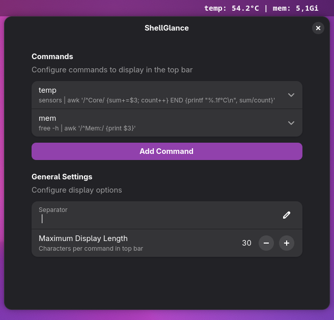
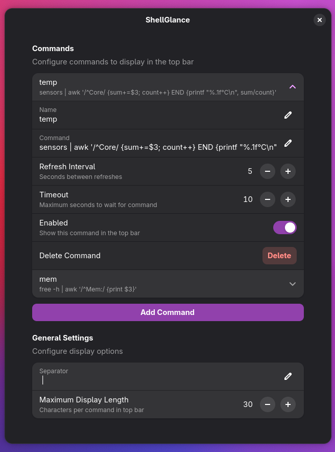

# ShellGlance

A GNOME Shell 49 extension that displays terminal command outputs in the top bar.

## Features

- **Multiple Commands**: Configure multiple shell commands with individual refresh intervals
- **Top Bar Display**: Combined output display with configurable separator (e.g., `CPU: 45% | RAM: 2.1G`)
- **Dropdown Menu**: Click to view full command outputs
- **Per-Command Settings**: Individual refresh intervals, timeouts, and enable/disable toggles
- **Error Handling**: Visual error indicator when commands fail
- **Configurable Timeout**: Default 10 seconds per command to prevent hanging

## Screenshots




## Requirements

- GNOME Shell 49

## Installation

### Manual Installation

1. Clone or download this repository:
   ```bash
   git clone https://github.com/yourusername/ShellGlance.git
   cd ShellGlance
   ```

2. Install the extension:
   ```bash
   make install
   ```

3. Restart GNOME Shell (logout/login on Wayland)

4. Enable the extension:
   ```bash
   make enable
   ```

## Configuration

Open the extension preferences via:
- GNOME Extensions app
- Running `gnome-extensions prefs shellglance@dnlvgl.com`
- Clicking "Settings" in the extension dropdown menu

### Command Settings

Each command has the following options:

| Setting | Description | Default |
|---------|-------------|---------|
| Name | Display name shown in top bar | - |
| Command | Shell command to execute | - |
| Refresh Interval | Seconds between refreshes | 5 |
| Timeout | Maximum seconds to wait | 10 |
| Enabled | Show in top bar | true |

### General Settings

| Setting | Description | Default |
|---------|-------------|---------|
| Separator | String between command outputs | ` \| ` |
| Max Display Length | Characters per command in top bar | 30 |

## Example Commands

```bash
# CPU usage
top -bn1 | grep "Cpu(s)" | awk '{print $2}' | cut -d'%' -f1

# Memory usage
free -h | awk '/^Mem:/ {print $3}'

# Disk usage
df -h / | awk 'NR==2 {print $5}'

# Network IP
hostname -I | awk '{print $1}'

# Temperature
sensors | awk '/^Core/ {sum+=$3; count++} END {print sum/count "°C"}'

```

## Development

```bash
make install   # First-time install
make update    # Update and toggle extension for reload
make enable    # Enable extension
make disable   # Disable extension
make prefs     # Open preferences
make logs      # Follow GNOME Shell logs
make zip       # Create distributable zip
make clean     # Remove build artifacts
```

To test changes, run `make update` then disable/enable the extension in the Extensions app.

## Troubleshooting

### Recompile Schemas

If settings aren't working, recompile and reinstall:

```bash
make update
```

## Resources

### Official Documentation

- [GNOME Shell Extensions Guide](https://gjs.guide/extensions/) - Comprehensive guide for extension development


## License

GPL-3.0 - see [LICENSE](LICENSE)
